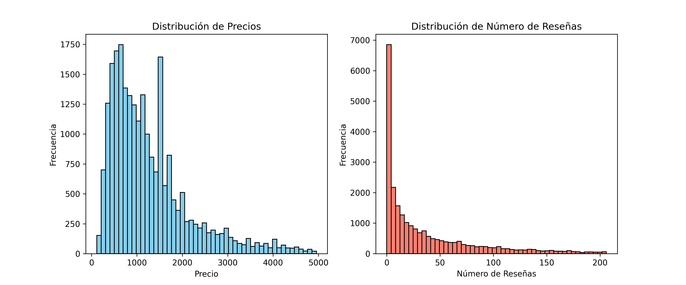
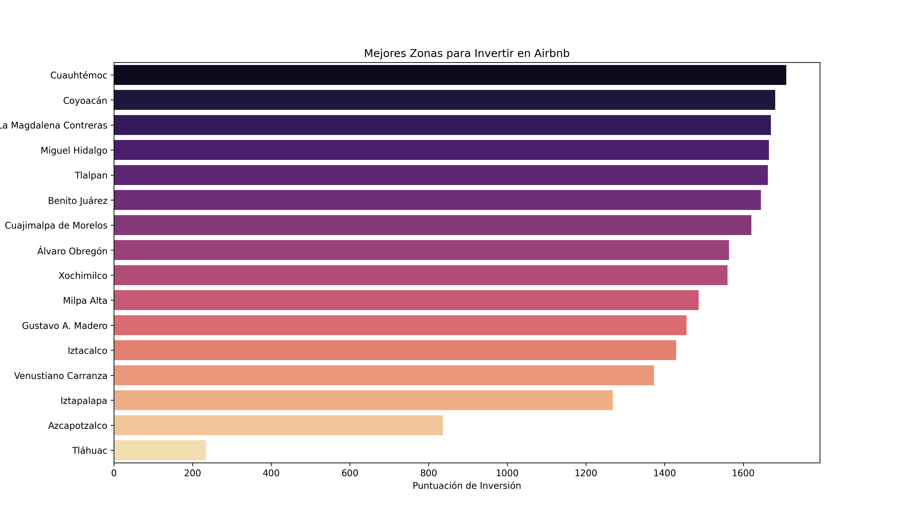
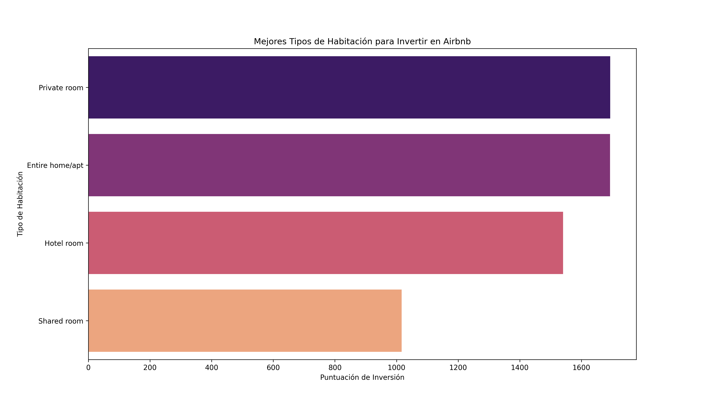

# Análisis de Airbnb en la Ciudad de México

Este documento detalla los análisis realizados sobre los listados de Airbnb en la Ciudad de México, incluyendo la metodología utilizada, las variables analizadas y las conclusiones obtenidas.

## 1. Objetivo del Análisis
Este proyecto tiene como propósito responder diferentes preguntas analíticas relacionadas con el precio, la disponibilidad y el número de reseñas, considerando variables clave como la zona (neighbourhood) y el tipo de habitación (room_type). A través de este análisis, se busca identificar las mejores zonas y tipos de alojamiento para realizar inversiones rentables en Airbnb.

## 2. Variables Analizadas
- Zona (neighbourhood): Área o colonia donde se encuentra el alojamiento, clave para identificar zonas con alta demanda.
- Tipo de habitación (room_type): Categoría de alojamiento (Entire home/apt, Private room, Shared room, Hotel room), lo que influye en la experiencia y costo.
- Precio (price): Costo por noche del listado, fundamental para evaluar la rentabilidad.
- Noches mínimas (minimum_nights): Cantidad mínima de noches que se debe reservar, relevante para estimar el flujo de ingresos.
- Número de reseñas (number_of_reviews): Refleja la popularidad y frecuencia de uso del alojamiento.
- Disponibilidad (availability_365): Número de días al año en que el alojamiento está disponible para reservaciones.

## 3. Analisis Descriptivo General
- **Resumen Estadistico General**

En la columna **price**, el precio promedio de los listados es de 1,280.37 pesos mexicanos, con un precio mínimo de 116 pesos y un máximo de 4,954 pesos. El 50% de los precios están por debajo de 1,050 pesos, lo que indica que la mayoría de los listados son accesibles, pero también existen algunas propiedades significativamente más caras.
En la columna **number_of_reviews**, los listados tienen en promedio 36 reseñas, con un mínimo de 0 reseñas y un máximo de 206 reseñas. El 75% de los listados tienen 53 reseñas o menos, lo que sugiere que la mayoría recibe un número moderado de evaluaciones.
Para **minimum_nights**, el número mínimo de noches requeridas es 1 noche, con un máximo sorprendente de 365 noches (aproximadamente 1 año), lo cual es poco común para Airbnb. El 50% de los listados exigen 2 noches o menos, y solo el 25% requiere más de 5 noches, lo que indica que las estancias cortas son las más comunes.
La columna **availability_365** muestra que los listados tienen una disponibilidad promedio de 219.73 días al año, con un mínimo de 0 días (posiblemente listados inactivos o no disponibles temporalmente) y un máximo de 365 días, indicando propiedades disponibles todo el año. El 50% de los listados están disponibles al menos 263 días al año, lo que sugiere una alta disponibilidad general en la mayoría de las propiedades.
Además, la columna **calculated_host_listings_count** revela que, en promedio, un anfitrión maneja alrededor de 16 listados, pero algunos tienen hasta 238 listados, lo que podría indicar la presencia de grandes anfitriones comerciales en la plataforma.

- **Histograma de Precios y Numero de Reseñas**

En estos histogramas podemos obserbar la distribucion de precios y de reseñas:
En la distribución de precios (izquierda), la mayoría de los listados tienen precios entre 500 y 2,000 pesos, con un pico notable alrededor de los 1,000 pesos. A medida que el precio aumenta, la cantidad de listados disminuye significativamente, pero aún existen listados premium con precios cercanos a los 5,000 pesos, aunque son poco frecuentes.
En la distribución del número de reseñas (derecha), observamos que un gran porcentaje de los listados tienen menos de 10 reseñas, siendo 0 reseñas el valor más frecuente. Sin embargo, algunos listados muy populares destacan al contar con más de 200 reseñas, lo que indica su alta demanda y uso frecuente.

## Preguntas a responder con el analisis de variables: 

- ¿Qué barrios tienen más listados en Airbnb?

En el gráfico se observa la distribución geográfica de los listados de Airbnb en la Ciudad de México. La mayoría de los listados se concentran en el centro de la ciudad, especialmente en barrios como Cuauhtémoc, conocido por sus zonas turísticas como la colonia Roma y Condesa, y Miguel Hidalgo, que incluye áreas exclusivas como Polanco.
A medida que nos alejamos del centro, la densidad de listados disminuye notablemente, destacando barrios con menos presencia como Tláhuac y Milpa Alta, ubicados en las periferias de la ciudad, donde la oferta de alojamientos es significativamente menor.

- ¿Qué tipos de habitaciones son más populares y donde se encuentran?

Las gráficas muestran que el tipo de habitación más popular en los listados de Airbnb es el "Entire home/apt" (Casa/apto entero), con una cantidad considerablemente mayor de listados en comparación con otras opciones como las habitaciones privadas, habitaciones de hotel y, en último lugar, las habitaciones compartidas.

El barrio de Cuauhtémoc destaca como el área con la mayor cantidad de listados de "Entire home/apt", lo que no sorprende debido a su ubicación céntrica y su popularidad entre turistas y viajeros. Por otro lado, Milpa Alta se posiciona como el barrio con la menor cantidad de este tipo de alojamientos, reflejando su ubicación periférica y menor actividad turística en comparación con otras zonas de la ciudad.

- ¿Qué tan disponibles están los listados durante el año en cada barrio?

La gráfica revela que los barrios periféricos de la Ciudad de México presentan una mayor disponibilidad de listados durante el año, encabezados por Milpa Alta, cuya disponibilidad destaca notablemente frente a otras zonas. Este fenómeno podría atribuirse a una menor demanda turística, permitiendo que los listados permanezcan disponibles por más tiempo. Tláhuac e Iztapalapa siguen la misma tendencia, lo que sugiere que, aunque ofrecen precios accesibles, no son las zonas más buscadas por los visitantes.
En contraste, barrios céntricos y populares como Miguel Hidalgo, Cuauhtémoc y Benito Juárez muestran una disponibilidad significativamente menor, probablemente debido a la alta rotación y demanda constante de turistas, lo que hace que las propiedades se ocupen rápidamente y con frecuencia.
Podemos suponer que los barrios periféricos pueden representar una oportunidad para estancias más flexibles, mientras que las zonas centrales, aunque con menor disponibilidad, mantienen una ocupación constante gracias a su atractivo turístico.

- ¿Cual es el rango de precios en los barrios?

En este Boxplot podemos observar que distribución del rango de precios en cada barrio de la Ciudad de México. Se observa que Cuauhtémoc y Miguel Hidalgo tienen una amplia dispersión de precios, desde opciones accesibles hasta alojamientos de lujo, lo que refuerza su popularidad y variedad de oferta.
Por otro lado, Milpa Alta, aunque presenta precios elevados en su mayoría, también muestra una menor dispersión, indicando que los precios son más consistentes y menos variados.
Los barrios con precios más bajos, como Tláhuac e Iztapalapa, no solo mantienen un rango inferior, sino que también tienen una menor dispersión, sugiriendo que la oferta es más homogénea y accesible, aunque con menos demanda turística.

- ¿Qué barrios y tipo de habitaciones reciben más reseñas al mes?

Los gráficos muestran que Venustiano Carranza lidera en el promedio de reseñas mensuales, destacándose notablemente a pesar de no figurar entre los barrios más caros ni con mayor disponibilidad, lo que sugiere que su popularidad podría estar relacionada con factores como accesibilidad o relación calidad-precio. Azcapotzalco e Iztacalco, que también mantienen una presencia intermedia en las demás métricas, ocupan los siguientes puestos, mientras que Cuauhtémoc, conocido por su alta demanda turística, aparece en cuarto lugar, lo cual sorprende considerando su gran cantidad de listados y precios altos.
Por otro lado, Tlahuac, con precios más bajos y mayor disponibilidad, muestra un menor número de reseñas mensuales, lo que podría indicar una menor atracción turística o preferencia por otras zonas.

En cuanto al tipo de habitación, Entire home/apt no solo es la opción más popular, sino también la que recibe más reseñas, lo que refuerza su preferencia entre los huéspedes. Un dato interesante es que las habitaciones compartidas (Shared room) reciben más reseñas que las habitaciones privadas (Private room) y las habitaciones de hotel (Hotel room), lo que podría reflejar una mayor interacción social en este tipo de alojamientos o un menor costo que motiva a los viajeros a compartir sus experiencias con mayor frecuencia.

- ¿Cuáles son las mejores zonas para invertir en un Airbnb?

Las mejores cinco zonas para invertir en Airbnb en la Ciudad de México, según la puntuación calculada, son Cuauhtémoc, Coyoacán, La Magdalena Contreras, Miguel Hidalgo y Tlalpan. Esta clasificación se obtiene mediante un análisis que pondera el número de reseñas, el rango de precios y la disponibilidad, dando más peso a aquellas zonas con alto movimiento de reseñas y una mayor variedad de precios. Por otro lado, las zonas menos recomendadas para invertir son Iztacalco, Venustiano Carranza, Iztapalapa, Azcapotzalco y Tláhuac, debido a su menor atractivo según los mismos criterios. Este modelo prioriza barrios con alta actividad de usuarios (reseñas), una amplia variabilidad en precios (posibilidades de rentabilidad diversa) y menor disponibilidad, ya que una alta ocupación suele reflejar mayor demanda y competitividad en la zona.

- ¿Cual es el mejor tipo de habitacion para invertir?

Podemos observar que "Private room" y "Entire home/apt" presentan puntuaciones muy similares, lo que sugiere que ambos son excelentes opciones para invertir. Esto refleja una preferencia de los huéspedes por alojamientos que ofrezcan privacidad y comodidad, factores clave en la elección de hospedaje. "Hotel room" también muestra una puntuación competitiva, lo que lo convierte en una opción atractiva; sin embargo, es importante considerar que este tipo de inversión suele requerir un mayor capital inicial y costos de mantenimiento. Por otro lado, "Shared room" obtiene la puntuación más baja, lo que indica que es la opción menos recomendable para invertir, probablemente porque los clientes valoran más la privacidad y la independencia, lo que hace que las habitaciones compartidas tengan menor demanda y rentabilidad.

## 4. Conclusiones
Las mejores zonas para invertir, como Cuauhtémoc, Coyoacán, La Magdalena Contreras, Miguel Hidalgo y Tlalpan, destacan por su alta actividad de usuarios (evidenciada en el número de reseñas) y una amplia variabilidad en precios, lo que sugiere que son áreas populares y rentables. Por otro lado, las zonas menos recomendadas (Iztacalco, Venustiano Carranza, Iztapalapa, Azcapotzalco y Tláhuac) muestran menor movimiento y competitividad, lo que sugiere una demanda más baja o menor atractivo para los visitantes. 

En cuanto a el mejor tipo de habitacion para invertir los huéspedes tienden a preferir alojamientos que ofrezcan mayor privacidad, como habitaciones privadas (Private room) y apartamentos completos (Entire home/apt). Esto se refleja en las altas puntuaciones obtenidas por estos tipos de alojamiento, lo que indica una mayor demanda y potencial de rentabilidad. Las habitaciones compartidas (Shared room) son la opción menos rentable debido a la menor demanda, lo que confirma que la privacidad es un factor decisivo para los huéspedes.

En conclusión, se recomienda enfocar las inversiones en zonas con alta actividad y amplia variedad de precios, así como en tipos de alojamiento que prioricen la privacidad, como habitaciones privadas y apartamentos completos. Además, es aconsejable realizar un análisis más detallado sobre la relación costo-beneficio entre las inversiones en hoteles y aquellas en habitaciones privadas o apartamentos completos, considerando factores como rentabilidad, costos operativos y mantenimiento. Por último, se sugiere profundizar en el estudio de las preferencias de los clientes para comprender mejor qué aspectos influyen en su elección entre diferentes tipos de alojamiento, como ubicación, comodidades, precio y políticas de hospedaje.
